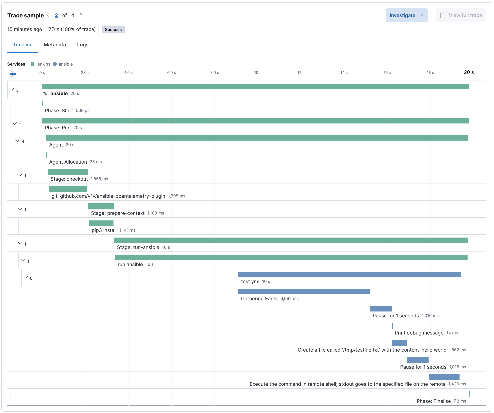

## Ansible plugin to send distributed traces with opentelemetry

It uses the callback functions:
- See https://github.com/ansible/ansible/blob/devel/lib/ansible/plugins/callback

### Opentelemetry API for python

https://opentelemetry-python.readthedocs.io/en/latest/getting-started.html

### How to use it

1) Copy `opentelemetry.py` to ./callback_plugins/opentelemetry.py
2) make -C jenkins start start-local-worker
3) open http://localhost:8080
$) Trigger a build

### Traces

#### Span attributes

|Name|Description|
|----|-----------|
|ansible.task.args| The task arguments |
|ansible.task.message| The task output |
|ansible.task.module| The module name |
|ansible.task.name| The task name |
|ansible.task.result| The task result |
|ansible.task.host.name| The hostname where the task run for |
|ansible.task.host.status| The task result for the host |

### Further references

For example

